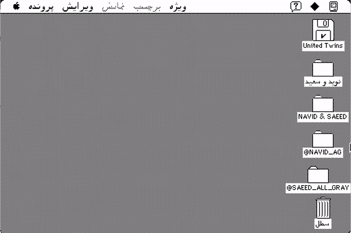

# Persian-Mac-System-7

Long story short, we have discovered a never-before-seen version of the macintosh, which we have fully explained in [this article](example.com). 

### Ingredients
Here are the materials you need in order to set up this simulation:
- [vMac emulator](https://www.gryphel.com/c/minivmac/download.html)
- Macintosh Plus Rom
- [The Persian System 7 `.dsk` file](https://github.com/NavidAG/Persian-Mac-System-7/blob/main/disks/persian_system_7.dsk)

In order to get Macintosh Plus ROM, download the "Old World Mac ROMs" file from [this Link](https://www.macintoshrepository.org/7038-all-macintosh-roms-68k-ppc-), then after uncompressing it, find the file named `1986-03 - 4D1EEAE1 - MacPlus v2.ROM`, which is under the "128k" directory.

[Download](https://github.com/NavidAG/Persian-Mac-System-7/blob/main/disks/persian_system_7.dsk) the The Persian System 7 disk file.

### Steps
1. Open vMac.
2. Drag the `.ROM` file into the vMac window.
3. Drag the `.dsk` file into the vMac window.

**Et Voilla!**

